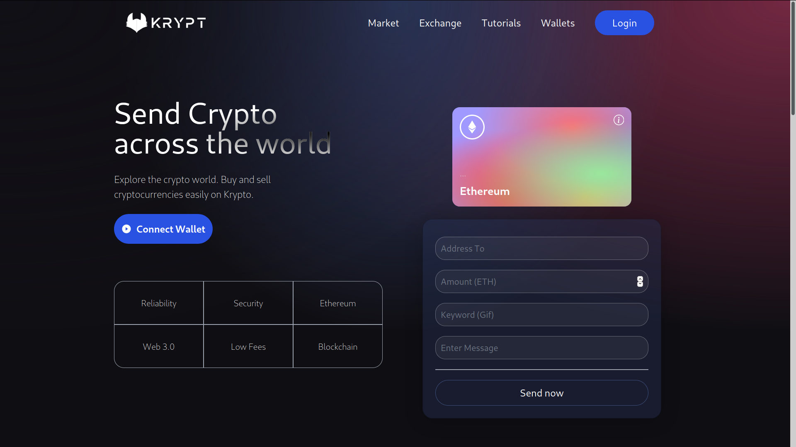
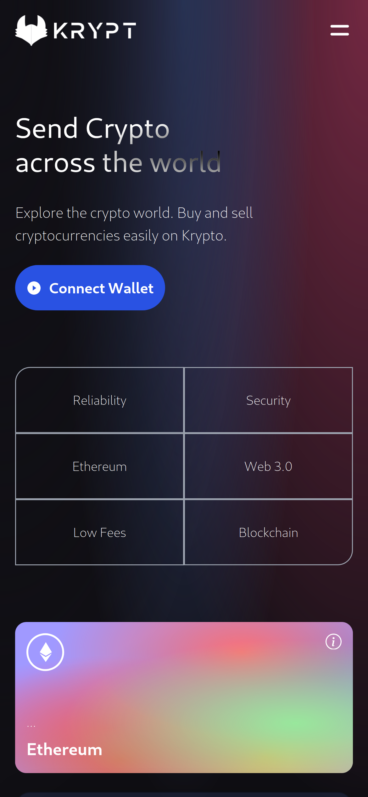

# Blockchain Web Development with Ethereum  

## Introduction

This is a code repository for the blockchain website with ReactJs, NodeJs and Ethereum.

Currently, the project only allow users to send ethereum to others via meta mask account and view transaction history. We plan to develop more feature in near future

## Responsive

Support smaller screen size and mobile device

